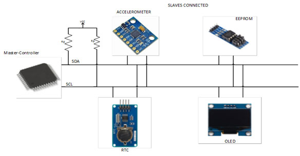
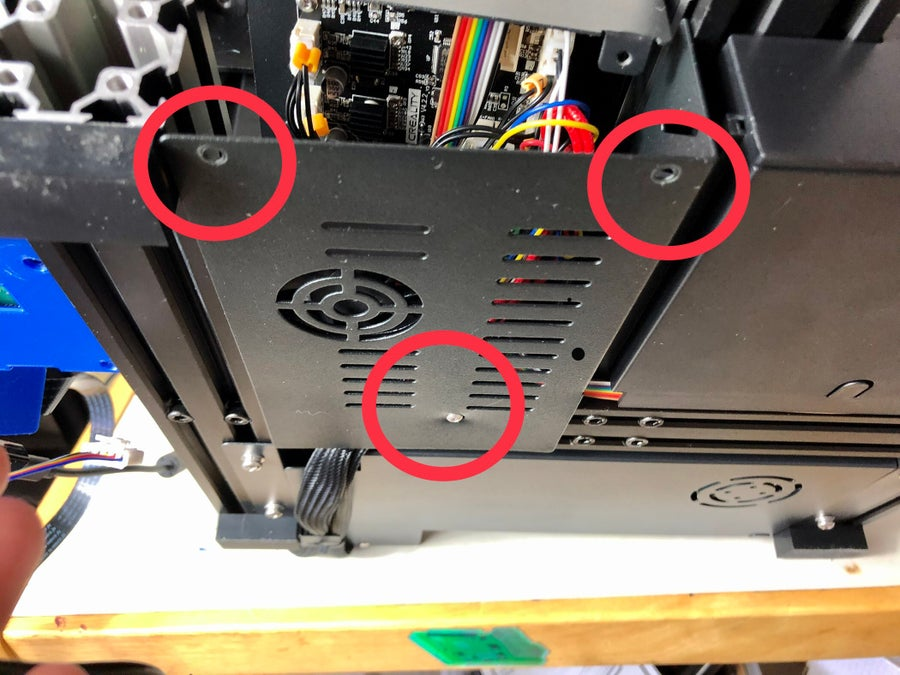
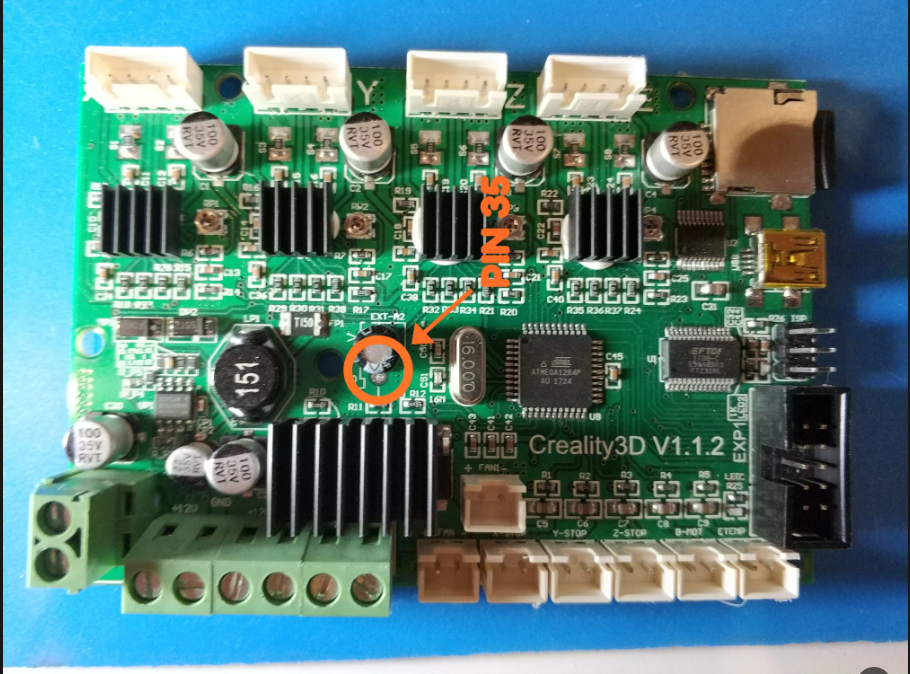
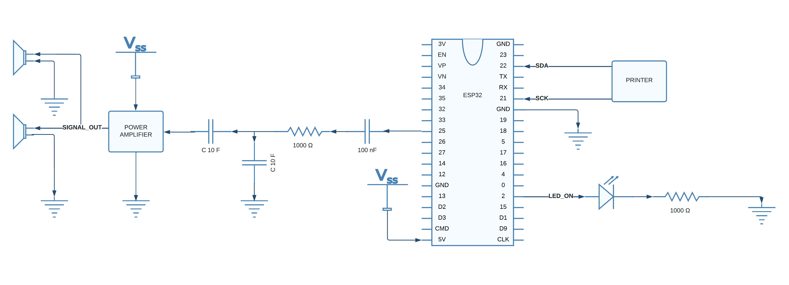

## Communication Protocol (I2C)

Echoprint uses a common communication protocol called I2C stands for "Inter-Integrated Circuit" and basically, the controller device (the printer) sends out an address that a device connected to the printer might have. In colloquial language, the printer is mailing out a message and is first seeing if the person is home. If there is a device on the connection lines that responds to the address, then it starts to listen to the incomming transmission. This allows us to hook more than one device upto these two data lines and allows further expansion of the printer.

## How to Install Echoprint

### 1. Remove the mainboard cover

Located on the bottom of the printer are three hex screws that utilize a size 2mm hex allen wrench. Remove these screws and gain acess to the main motherboard of the printer. Keep these screws somewhere save and when the cover comes off, there will be a fan cable attached to it, so disconnect it carefully. 

### 2 Install the bootloader for the Creality Ender 3 Pro

Before any code can be flashed onto the printer, the bootloader needs to be installed first. This allows the printer to run any code put on to it and configures all of the internal settings. The best method for this is following along with the video below. This is a simple process that is necessary for programming the printer for a variety of applications, not just Echoprint. 

Hardware Required: 
- [AVR USB ISP Programmer](https://www.amazon.com/dp/B07NZ59VK2?psc=1&ref=ppx_yo2ov_dt_b_product_details)
- [3x2 6-pin Ribbon Cables](https://www.amazon.com/dp/B07Q2SX5CX?psc=1&ref=ppx_yo2ov_dt_b_product_details)

Video:  

### 3. Download the repository from the [Echoprint Github](https://github.com/nickhoug/echoprint)

This repository holds everything from documentation to the Ender 3 CAD files for all of the mechanical parts. Most importantly is the directory: 
    
    echoprint/Ender-3 Firmware (Marlin)/Ender-3 (includes power failure resume- English)/Marlin/Marlin.ino

This is the Arduino source code for the Ender 3 Pro and includes the Echoprint library files within the parent directory "Marlin", plus all of the instances of where the functions need to be called. Mainly, these functions are congregated in the "ultralcd.cpp" file. 

### 4. Remove the circuit board from the printer. 

Around and within the circuit board are 6 hex screws that utilize the same screwdriver as before. Remove these screws and keep them somewhere save - they are all the same size. 

After this is done, disconnect all of the connections to the printer. It's intuitive where they go and they are all labeled, but make sure to take lots of pictures as you go. The goal is to remove the board and prepare it for soldering, so we need access to the other side. 

### 5. Solder and splice the necesary connections onto the Ender 3 mainboard. 

Now that we have the software downloaded, we now need to establish an I2C connection. Through the use of Pin 27 and Pin 29 on the Ender 3 mainboard. The mainboard is very short of GPIO pins, so were going to have to hack it to make it work. 

First off is pin 27. This is a forgotton GPIO pin located under one of the boards main capacitors. The story behind this was that there was a connector for it to expand the printers hardware, but due to heating issues, this connector was removed and a capacitor was put in it's place. Located as shown in the picture below (this is from a dated source, and back then, it was still called pin 35). Make sure to cover with either heat shrink or electrical tape.

To get access to the pin, the solder needs to be removed from the hole and a jumper/wire needs to be resoldered in it's place. For the Echoprint application, a male jumper with a female end thats around 8 inches long is recommended.

Next up is pin 29. This pin is connected to the buzzer located on the LCD screen for the printer and to gain access, we need to splice into it using the rainbow ribbon connector on the printer. There are adapters made for this pin, but splicing into the wire works just as well. it is important to note that this will **remove buzzer functionality**. The engineering choice made here was that if exterrnal speakers were being added to the printer, the haptic feedback buzzer was worth ditching. On the rainbow LCD connector, the one that plugs into the black 2x5 connector near the USB port, cut the **brown** wire about an inch from the connection. Pull this wire away from the rest of the ribbon cable and solder another female jumper to it, again 8 inches in length. Again, make sure to cover with either heat shrink or electrical tape. 

### 6. Add power and ground lines 

Now that the data lines are established, we now need power and ground. In between the 2x5 LCD display connectopr and the USB is a 3x2 header pin connector. On the side closest to the edgeof the PCB and in the orientation as shown in the picture above, the pin closest to the USB port is the Ground pin and the pin closest to the LCD connector is the Power pin, skipping the one in the middle. Connect female-to-female jumpers to these pins and make sure the connections are about 8 inches long. 

### 7. Reinstallation

Once these two connections are made, reinstall the mainboard following the reverse steps as before and route the connections threw the small notch in the top plate; the plate the board is mounted to. Make sure to mount the bottom cover and fan back to the board and plugging it in the process. 

### 8. Mount Echoprint

Now that all of the electrical connections are made, we can start mounting the Echoprint system. Uncover the Echoprint system and locate the header pins. Using the schematic below, wire up all the connections, route it through the routing hole at the top of the box, and recover Echoprint. 

With the printer's LCD facing you, on the bottom right are 2 M4 screws. Unscrew these and thread them through the cooresponding holes on the Echoprint mount. Screw the screws back in to the holes they came out of and the Echoprint system is mounted. 

### 8. Finish

After this, Echoprint should power on with your printer and using 1980's text-to-speech technology, read out the LCD on the Ender 3 Pro. 